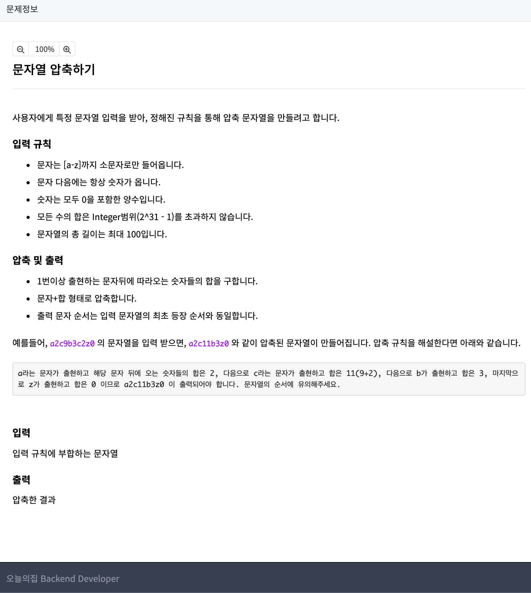

<p align="center" >
  
</p>


```js
const solution = (s) => {
  let str = s.replace(/[0-9]/g,'').split('');
  let nums = s.replace(/[a-z]/g,' ').split(' ');
  let result = '';
  let arr = [];
  let hash = new Map();

  nums = nums.filter(el => el !== '');

  for(let i=0; i<str.length; i++) {
    arr.push(str[i] + nums[i]);
  }
  
  for(const x of arr) {
    if(!hash.has(x[0])){
      hash.set(x[0],x[1]);
    }else{
      hash.set(x[0], hash.get(x[0]) + x[1]);
    }
  }

  for(const [str, num] of hash) {
    result += (str + num);
  }
  return result;
}

let str = 'a2a322a6d9j1'
solution(str)
```